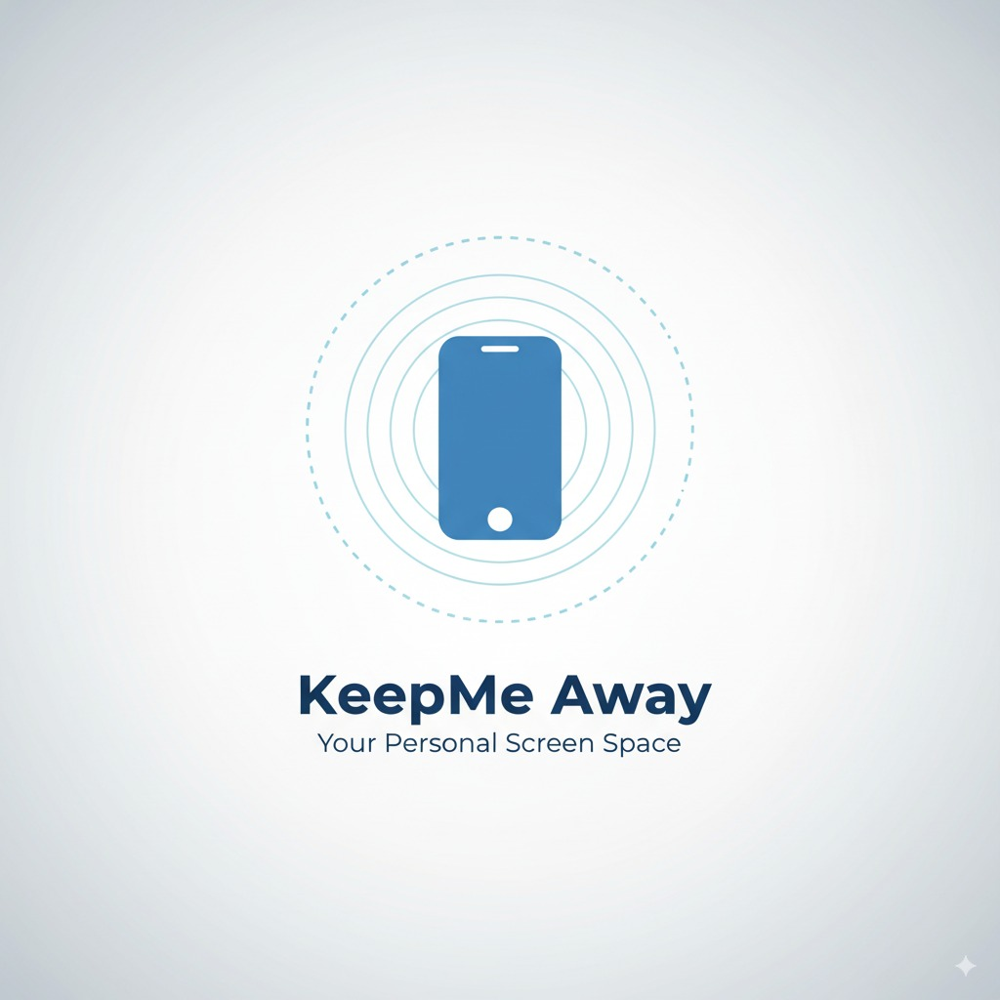

	

<h1 align="center">KeepMe Away</h1>

Protect your eyes by keeping a healthy distance from the screen. All processing happens on your device — no uploads, no tracking. 🔒📵

---

## Why use it? 💡

- 👀 Reduce eye strain and fatigue
- 🧒 Encourage healthy screen habits for kids
- 📚 Help students maintain good posture while studying
- 📱 For heavy phone users who sit too close without noticing

## What it does 🛡️

- Uses the front camera to estimate how close your face is to the screen
- Warns you if you’re too close and, on Android, can dim/block the screen until you move back
- Works entirely offline and on-device — images aren’t saved or sent anywhere

## Key features ✨

- 🔍 On‑device face proximity detection (privacy‑first)
- 🎯 One‑time calibration at your comfortable distance
- ⏱️ Warning countdown, then protective overlay (Android)
- 🧩 Fine‑tune sensitivity, thresholds, and warning time
- ⚡ Lightweight and battery‑friendly

## Privacy first 🔒

- 100% on‑device processing with Google ML Kit
- No photos or video are stored
- No data is transmitted; internet not required

## Get the app ⬇️

Go to the Releases page of this repository and download the latest APK for your device:

- arm64‑v8a (most modern Android phones)
- armeabi‑v7a (older devices)
- x86_64 (emulators)

Then install the APK on your Android device.

## Quick start 🚀

1. Install and open the app
2. Grant Camera permission (and Overlay permission on Android)
3. Calibrate once at a comfortable distance
4. Tap “Start Protection” — you can minimize the app; it keeps guarding you

## Permissions explained (Android) 🔐

- Camera: measure face size on‑device to infer distance
- Display over other apps: show the warning/black overlay when too close
- Ignore battery optimizations (optional): improve reliability in the background

## Settings ⚙️

- Threshold factor: how close triggers a warning (higher = less sensitive)
- Hysteresis: prevents flickering around the boundary
- Warning time: how long to wait before blocking

## Supported platforms 📱

- Android 7.0+ fully supported (foreground service + overlay)
- iOS builds exist but the overlay behavior is Android‑only

## Troubleshooting 🧰

- Not detecting face? Ensure good lighting and front camera is unobstructed
- Overlay didn’t appear? Grant “Display over other apps” permission
- Stops in background? Disable battery optimizations for the app
- Calibration failed? Sit still, keep your face in view, and retry

## FAQ ❓

- Does the app record or upload video? No. It processes frames on‑device and discards them
- Does it work offline? Yes
- Battery impact? Minimal — tuned for efficiency

## Contribute 🤝

Issues and PRs are welcome. Ideas: improved UX, accessibility, localization, enhanced detection.

## License 📄

MIT — see `LICENSE`.

